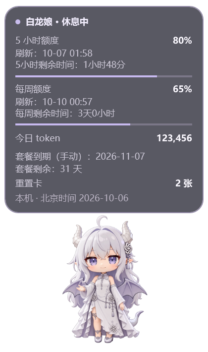

# 白龙娘 Codex 桌宠

按参考截图制作的社区 GPT 白龙娘形象，显示 Codex 额度、今日 token 和本机任务状态。Windows 本地配套组件；非 OpenAI 官方产品。

 


上图为演示数据。

## 启动

双击 `Start.vbs`。也可以在本目录运行：

```powershell
powershell.exe -NoProfile -ExecutionPolicy Bypass -STA -File .\pet.ps1
```

需要 Windows 10/11、Windows PowerShell 5.1、Python 3.10+，以及已登录的 Codex 桌面应用。先通过本页 **Code → Download ZIP** 下载并解压，然后双击 `Start.vbs`。优先使用 Codex 已安装的 Python 运行时；找不到时使用 PATH 中的 Python。无需安装 Python 第三方包。`ExecutionPolicy Bypass` 仅用于该启动进程，不修改系统设置。

拖动角色或卡片移动。右键可调整大小、关闭呼吸动画、收起面板和退出；Esc 也可退出。位置和设置保存在 `runtime/settings.json`。重复启动不会多开。不会注册开机启动或更换现有官方桌宠。

## 显示规则

- 没有运行中的本机任务：显示 5 小时和每周剩余百分比，以及今日 token。
- 本机任务运行中：优先显示当前会话最新一条请求，过滤附件列表和应用环境信息；没有可识别请求时回退到会话标题。另显示思考／工作状态和并行任务数量。
- 可识别的输入请求、审批请求：优先显示需要确认；需要在 Codex 主应用处理。
- 本机 Codex 有未读会话、未读收件箱消息或待回答的异步提问：切换递信姿势和金色提示，显示待处理数量。即使平时收起面板，提醒时也会临时显示；在 Codex 中处理后自动恢复工作／用量状态。
- 任务结束：恢复用量卡片。最近的明确错误事件短暂显示出错状态。

右键菜单的“角色大小”滑块替代原有小／中／大档位。范围为初版角色的 40%–100%，每次调整 5%，默认 60%，已有大小设置保留。拖动即时生效并立即保存；与字号、面板透明度独立。50%／60%／75% 对应此前小／中／大，角色框约 106 × 147、127 × 176、159 × 221 个逻辑像素。调大时会保持窗口在屏幕工作区内。

右键菜单顶部提供字号滑块，范围 10–18，按 1 递增，默认 12。正文、时间、数值、标题和菜单使用所选字号，调整即时生效并立即保存到 `runtime/settings.json`。角色大小独立于字号；卡片宽度随字号调整，高度随当前内容自动收缩，角色紧挨面板下缘；收起面板时也收起占位空白。

字号滑块下方提供“面板不透明度”滑块，范围 20%–100%，按 5% 递增，默认 95%。100% 完全不透明，20% 更透明。卡片背景、边框和文字一起改变透明度，角色和右键菜单保持清晰。拖动即时生效并立即保存，下次启动沿用设置。

已启用 Per-Monitor V2 DPI 和 WPF 随监视器 DPI 变化缩放：1080p、1440p（2K）、2160p（4K）沿用 Windows“显示缩放”，不按分辨率盲目乘倍率。字号是 96 DPI 下的逻辑像素；例如选择 12，系统 150% 时实际绘制约 18 像素。选择不同角色档位不会改变字号。已做 100%／150%／200% 渲染验证，跨实际不同 DPI 屏幕的拖动尚未实机验证。

空闲卡片直接显示两项额度各自的下一次刷新（恢复／重置）时间，使用北京时间 `MM-dd HH:mm`。这些时间来自服务器 `resetsAt`；它们与每 60 秒查询一次读数的刷新频率不同。刷新时间下方追加倒计时：5 小时额度显示“5小时剩余时间：x小时x分”，每周额度显示“每周剩余时间：x天x小时”。按服务器重置时间和当前时间计算，每秒更新；不足显示单位的部分舍去，过期归零，时间未知显示 `--`。

空闲时角色左手自然放下；工作、思考时换成托腮思考姿势；有消息或提问待处理时，双臂伸出递信。三种姿势使用独立透明 PNG，配合轻微呼吸和上下浮动动画。

空闲面板还显示套餐到期日、剩余天数和重置卡数量。到期日通过右键菜单的日期选择器手动设置／清除，保存在本机设置中；当前 Codex 账户接口未提供订阅到期日，不能自动确认续订或取消情况。剩余天数按北京时间日期差计算，当天显示“今天到期”，过去显示“已到期”。重置卡数量每 60 秒从 `account/rateLimits/read` 的 `rateLimitResetCredits.availableCount` 自动读取；未知或连接失败显示 `--`，明确的零显示 0 张。不会兑换重置卡。

## 数据口径与限制

额度每 60 秒在独立后台线程通过当前 Codex 的 `account/rateLimits/read` 只读接口查询，不阻塞任务状态刷新。不会调用模型、发送聊天或消耗模型 token。若接口暂不可用，退回会话记录里的最近读数，并标记旧数据；已过重置时间的旧读数显示 `--`。

今日 token 是北京时间 00:00 到现在，本机可读取的 Codex 活跃／归档会话日志中的 token。按 response ID 去重，避免分叉或重复日志多算；包含缓存输入，输出已含推理，不重复累加。旧日志使用累计值差分。无法覆盖别的设备、未落盘或已删除的会话、没有 token 日志的云端对话，不代表所有 ChatGPT 聊天用量。

没有 response ID 的旧记录与新格式混用时，通过迁移边界和明确镜像快照去重，无法保证任意历史混合日志都能完全对应。增量扫描通过文件身份、修改时间和头尾锚点检测正常的替换／重写。

悬停卡片可查看缓存／输出明细、额度刷新与重置时间，以及 `account/usage/read` 返回的账户当日 token。后者采用服务端日期口径，时区和同步延迟未经确认，因此与北京时间本机统计分开显示。

任务状态每 2 秒从本机日志推断，属于配套组件的状态显示，不复用或修改官方桌宠活动托盘。工作摘要来自最近的用户请求，仅显示最多 180 字的简短内容；过滤应用环境信息、附件列表和结构化提问回答。摘要与任务标题只保存在本机 runtime，发布预览使用演示数据。部分审批、异步等待和错误可能未写入日志，不能保证完整复现原生状态；长时间没新事件会提示查看应用。进程异常或强退留下的开始事件可能暂时被认为仍在工作。云端和其他设备的实时状态不在监测范围内。

消息提醒每 2 秒只读本机 `.codex-global-state.json` 的未读会话列表，以及 `sqlite/codex-dev.db` 的未读收件箱项。会话未读列表仅匹配本机未归档会话；同一会话多个提示合并计数。异步提问不会因工具返回“已展示”或当前任务结束而消失，收到对应问题的明确回答后才清除。桌宠不会替你标记已读或回答；短暂读取失败保留上一次提示并注明读取不完整。只解析提问回应的结构化元数据，不将消息正文显示在桌宠上。

这些未读存储是当前桌面应用的内部格式，并非稳定公开 API；已在本机安装版本验证，未来版本改变格式可能需要适配。无法保证覆盖所有云端提示、自动审批或没有落盘的提问。

除 Codex 官方只读查询外，不建立第三方网络连接，不提取或保存密钥。当前已有登录态由 Codex app-server 使用；其运行会使用正常的应用缓存目录。桌宠只在自身 `runtime/` 写入状态和设置文件。

## 验证

```powershell
python -m unittest discover -s . -p test_collector.py
python collector.py --once --local-only
```

28 项单元测试覆盖：北京时间跨午夜、response ID 去重、旧／新计数迁移、空 usage、坏 JSON、日志重写、未写完的 JSONL 行重试、任务完成与待输入解除、后台查询、进程取消和文件锁重试，以及未读提醒、读取失败缓存、提示优先级、异步提问的多问题回答与取消、最近请求摘要及上下文元数据过滤、重置卡数量的未知／零／明细截断处理。测试中的账户连接全部模拟。另已验证真实只读账户接口，并渲染检查三种 WPF 窗口布局。

启动失败会弹出错误提示，记录在 `runtime/startup-error.txt`；采集器异常会显示停止提示，错误记录在 `runtime/collector-error.txt`。退出会等待自己的采集器清理，避免快速重启时多开。

官方接口文档：https://learn.chatgpt.com/docs/app-server

## 素材

使用 ImageGen，根据提供的社区白龙娘参考截图生成透明角色素材，保存为 `assets/dragon.png`；在此基础上生成 `assets/dragon-idle.png`、`assets/dragon-thinking.png` 和 `assets/dragon-letter.png`。递信姿势按反馈修订为双臂伸出。角色为社区二创形象，并非官方 OpenAI 吉祥物。仓库不包含原视频或截图。

生成提示词见 `asset-prompt.txt`。代码按 MIT 许可发布；角色素材不纳入 MIT 许可，相关角色设计的权利归原权利人，详见 `NOTICE.md`。
